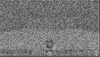
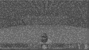
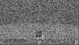
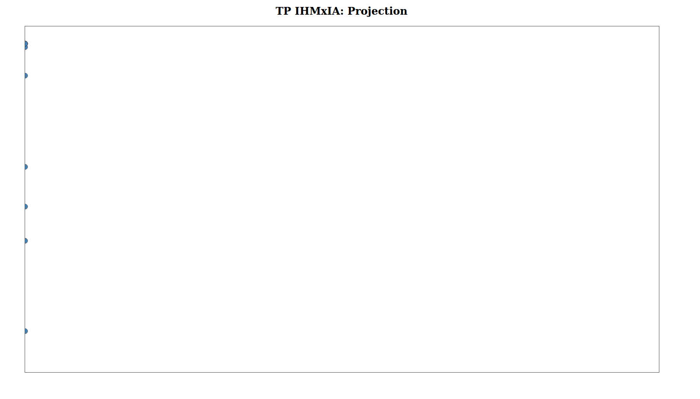

Étudiants : Emna Barred & Nabil Lamrabet.

Encadrants : Théo Jaunet & Aurélien Tabard.

IHMxIA, Master IA, Université Lyon 1, année 2020-2021.

#  TP Interpretable Deep Reinforcement Learning

## Saliency Maps

Nous avons modifié la méthode `get_best_action_wGrad` pour rétro-propager le gradient par rapport à l'action choisie. Nous obtenons le code suivant  :

```python

def get_best_action_wGrad(self, state):
    state = torch.from_numpy(state).to(device)
    state.requires_grad = True
    q = self.model(state)
    m, index = torch.max(q, 1)
    action = index.item()

    target = torch.FloatTensor([self.actions[index]])
    q.backward(gradient=target)
    state.detach_()

    grads = np.squeeze(state.grad.data.cpu().numpy())
    grads *= 254
    grads = grads.astype(np.int8)

    return action, grads.transpose((1, 0))
```

Nous obtenons une image bruitée (cf : Figure 1).





Pour débruiter notre map, on sélectionne uniquement les valeurs positives ou uniquement les valeurs négatives (remarque : il ne s'agit pas de guided back-propagation, comme demandé dans le sujet). Les résultats de cette étape est visible Figure 2 et 3. 

```python
def positive_saliency(gradient):
    pos_saliency = np.maximum(0, gradient)
    return pos_saliency

def negative_saliency(gradient):
    neg_saliency = np.minimum(0, gradient)
    return neg_saliency

```

Nous sommes plutôt perplexes quant aux résultats obtenus (ça ne ressemble pas vraiment à ce qu'on peut voir habituellement). Nous reviendrons plus tard sur cette étape si nous avons du temps pour implémenter correctement une guided back-propagation.





## Projection Umap

On modifie notre modèle afin de retourner également la dernière couche convolutionnelle lors du forward. On modifie la méthode forward du modèle de la façon suivante :

```python
def forward(self, x):
    x = self.relu1(self.bn1(self.conv1(x)))
    x = self.relu2(self.bn2(self.conv2(x)))
    xconv = self.conv3(x)
    x = self.relu3(self.bn3(xconv))

    return self.head(x.view(x.size(0), -1)), self.head(xconv.view(xconv.size(0), -1))
```

Dans la méthode `get_best_action_wGrad`, on transforme notre vecteur `xconv = np.squeeze(xconv.cpu().detach().numpy()).tolist()`.

Enfin, dans la fonction `run`, on agrège tous les vecteurs dans une liste mydata. À partir de cette liste on effectue une projection Umap :

```python    
embedding = umap.UMAP(n_neighbors=5, min_dist=0.3, metric='correlation').fit_transform(mydata)
```

Pour visualiser notre projection, on utilise `embedding2csv(embedding, colors)` où `colors` est un vecteur correspondant à l'action à chaque étape (`colors.append(best_action_index)`).

Notre fichier projection.csv est le suivant :

```
x,y,arg
18.23979,1.8313566,0
17.608364,1.1925493,0
18.37857,0.950555,0
16.523409,-2.589092,2
16.434586,0.025694015,1
16.002901,0.6707873,1
15.58519,-1.1855209,2
15.549779,-0.17483917,1
15.624693,-2.144331,2
16.43295,-1.8017131,2
```

Il semble y a voir un problème avec nos données, elles ont un y qui tourne autour de 0 ce qui rend la visualisation difficile (Figure 4).



On suppose qu'il y a une erreur dans le calcul avant la projection Umap (on obtient difficilement mieux en modifiant les paramètres).
